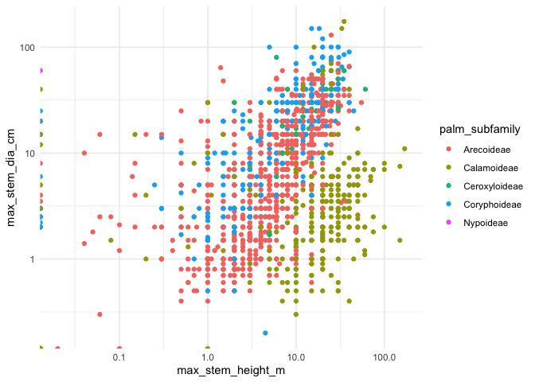
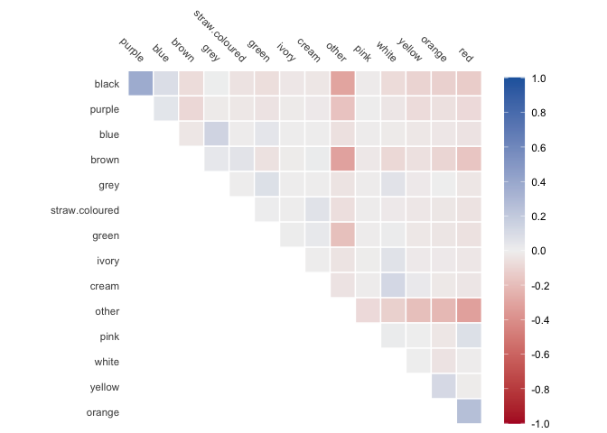

<!-- README.md is generated from README.Rmd. Please edit that file -->

# palmtrees 

<!-- badges: start -->
<!-- badges: end -->

The goal of palmtrees is to provide the data set [PalmTraits
1.0](https://www.nature.com/articles/s41597-019-0189-0) which is a
species-level functional trait database of palms worldwide.

## Installation

You can install the development version of palmtrees from
[GitHub](https://github.com/) with:

``` r
# install.packages("devtools")
devtools::install_github("EmilHvitfeldt/palmtrees")
```

## Example

The data set includes information about taxonamy, physical feautures

``` r
library(tidyverse)
library(palmtrees)

glimpse(palmtrees)
#> Rows: 2,557
#> Columns: 29
#> $ spec_name               <chr> "Acanthophoenix crinita", "Acanthophoenix rous…
#> $ acc_genus               <chr> "Acanthophoenix", "Acanthophoenix", "Acanthoph…
#> $ acc_species             <chr> "crinita", "rousselii", "rubra", "wrightii", "…
#> $ palm_tribe              <chr> "Areceae", "Areceae", "Areceae", "Trachycarpea…
#> $ palm_subfamily          <chr> "Arecoideae", "Arecoideae", "Arecoideae", "Cor…
#> $ climbing                <fct> climbing, climbing, climbing, climbing, climbi…
#> $ acaulescent             <fct> acaulescent, acaulescent, acaulescent, acaules…
#> $ erect                   <fct> non-erect, non-erect, non-erect, non-erect, no…
#> $ stem_solitary           <fct> non-solitary, non-solitary, non-solitary, soli…
#> $ stem_armed              <fct> non-armed, non-armed, non-armed, armed, non-ar…
#> $ leaves_armed            <fct> non-armed, non-armed, non-armed, non-armed, no…
#> $ max_stem_height_m       <dbl> 10.0, 25.0, 15.0, 9.1, 12.0, 18.0, 0.0, NA, 0.…
#> $ max_stem_dia_cm         <dbl> 20.0, 30.0, 18.0, 15.0, 50.0, 35.0, NA, NA, NA…
#> $ understorey_canopy      <fct> canopy, canopy, canopy, canopy, canopy, canopy…
#> $ max_leaf_number         <dbl> 15, NA, 20, 25, 30, 15, NA, NA, 6, NA, NA, NA,…
#> $ max__blade__length_m    <dbl> 2.30, 3.00, 3.10, 1.30, 3.50, 3.00, NA, NA, 0.…
#> $ max__rachis__length_m   <dbl> NA, NA, 3.00, 0.70, 2.50, NA, NA, NA, 0.54, NA…
#> $ max__petiole_length_m   <dbl> NA, NA, NA, 0.65, NA, 0.65, NA, NA, 0.51, NA, …
#> $ average_fruit_length_cm <dbl> 0.65, 2.00, 1.00, 0.70, 4.25, 2.50, 2.00, NA, …
#> $ min_fruit_length_cm     <dbl> 0.6, NA, NA, NA, 3.5, NA, NA, NA, 1.5, 3.8, NA…
#> $ max_fruit_length_cm     <dbl> 0.7, NA, NA, NA, 5.0, NA, NA, NA, 3.0, 5.4, NA…
#> $ average_fruit_width_cm  <dbl> 0.50, 0.80, 0.70, 0.70, 4.60, 1.80, 2.00, NA, …
#> $ min_fruit_width_cm      <dbl> NA, NA, NA, 0.5, 3.8, NA, NA, NA, 1.5, 3.8, NA…
#> $ max_fruit_width_cm      <dbl> NA, NA, NA, 0.9, 5.4, NA, NA, NA, 3.0, 5.4, NA…
#> $ fruit_size_categorical  <fct> small, small, small, small, large, small, smal…
#> $ fruit_shape             <fct> NA, ovoid, ovoid, ovoid, ovoid, globose, NA, N…
#> $ fruit_color_description <chr> "black", "black", "black", "orange-brown; beco…
#> $ main_fruit_colors       <chr> "black", "black", "black", "brown; black", "gr…
#> $ conspicuousness         <fct> cryptic, cryptic, cryptic, cryptic, cryptic, c…
```

So we can look at how the the sizes of the different species of palms
vary across sub families

``` r
palmtrees |>
  ggplot(aes(max_stem_height_m, max_stem_dia_cm, color = palm_subfamily)) +
  geom_point() +
  scale_y_log10() +
  scale_x_log10() +
  theme_minimal()
```



And we can see which colors of the fruit co-occur a lot

``` r
library(recipes)
library(corrr)

recipe(~main_fruit_colors, data = palmtrees) |>
  step_dummy_extract(main_fruit_colors, sep = "; ") |>
  prep() |>
  bake(new_data = NULL) |>
  rename_with(\(x) str_remove(x, "main_fruit_colors_")) |>
  correlate() |>
  autoplot()
```


